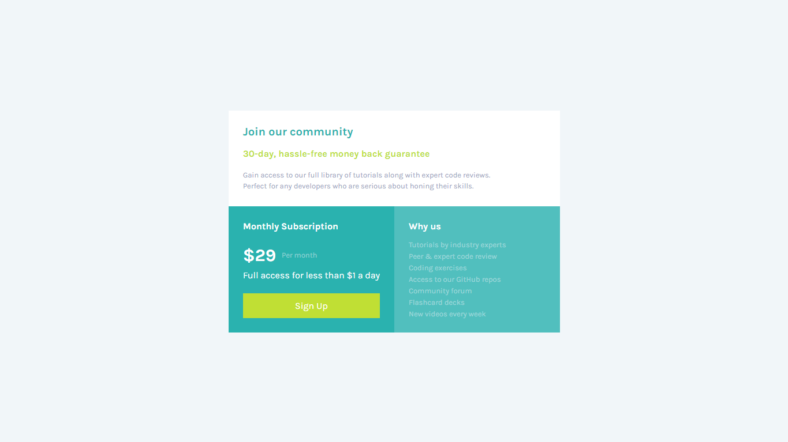

# Single price grid component

Isso é uma solução criada do desafio do: [Frontend Mentor](https://www.frontendmentor.io/challenges/single-price-grid-component-5ce41129d0ff452fec5abbbc). 

**Atenção o código apresentado é de minha autoria, não foi copiado de tutoriais, cursos e etc.**
## Tabela de conteúdo

- [Geral](#geral)
  - [O desafio](#o-desafio)
  - [Prints](#prints)
  - [Links](#links)
- [Meu processo](#meu-processo)
  - [Construido com](#Construido-com)
  - [O que eu aprendi](#o-que-eu-aprendi)
  - [Considerações finais](#Considerações-finais)
  - [Recursos que me ajudaram](#Recursos-que-me-ajudaram)
- [Autor](#autor)

## Geral

### O desafio:

O usuário deverá:

    -Ter o layout otimizado para cada tipo de dispositivo (responsividade)
    -Observar os elementos com hover na pagina

### Prints

Mobile:  

Desktop:  

Hovers  

### Links

- Site: [Clique aqui para acessar o site](https://matheuzeba.github.io/Single-price-grid-component/)

## Meu processo

### Construido com

- Html5 sematico
- CSS
- Flexbox
- Grid
- Mobile-first 

### O que eu aprendi

Esse foi o meu primeiro projeto utilizando o Css Grid, foi muito legal brincar com ele e ler um pouco da documentação dele na internet.
Esse projeto me ajudou a entender o Grid de maneira geral e a melhorar minha observação para escolher as tags e propriedades corretas.

### Considerações finais

Eu aprendi muito com esse desafio, e percebi que o grid auxilia muito na criação de layouts "diferentes", ou melhor específicos.

Também aprendi a usar o flexbox em certas partes do desafio:  

No geral sinto que meu código ficou mais organizado e mais facil de entender.

### Recursos que me ajudaram

- [Learn CSS Grid the easy way](https://www.youtube.com/watch?v=rg7Fvvl3taU&pp=ygURa2V2aW4gcG93ZWxsIGdyaWQ%3D)

- [Css Grid do w3school](https://www.w3schools.com/css/css_grid.asp)

- [Css grid do MDN](https://developer.mozilla.org/pt-BR/docs/Web/CSS/grid)

- [Uma discussão no Reddit de quando se deve usar o grid ou flexbox](https://old.reddit.com/r/Frontend/comments/g05kc1/when_should_you_use_grid_css_instead_of_flexbox/)

## autor

- Github - [matheuzeba](https://github.com/matheuzeba)
- Linkedin - [Meu Linkedin](https://www.linkedin.com/in/matheus-tavares-viana/?lipi=urn%3Ali%3Apage%3Ad_flagship3_profile_view_base_contact_details%3B3vUQkfjeQFmmKSAvffOo%2Fg%3D%3D)
